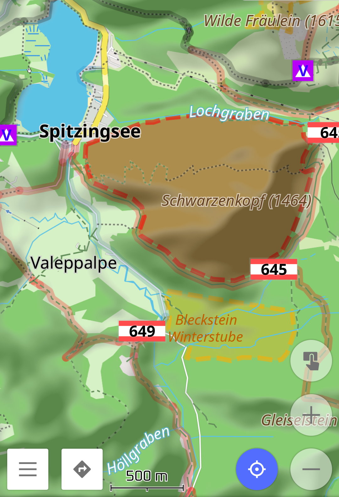
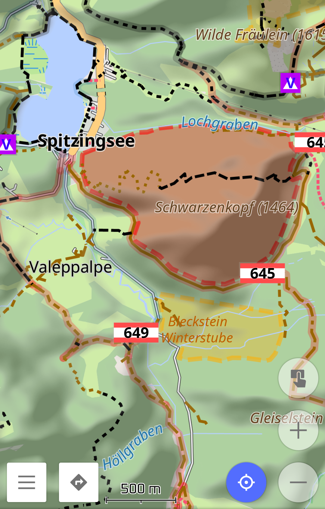
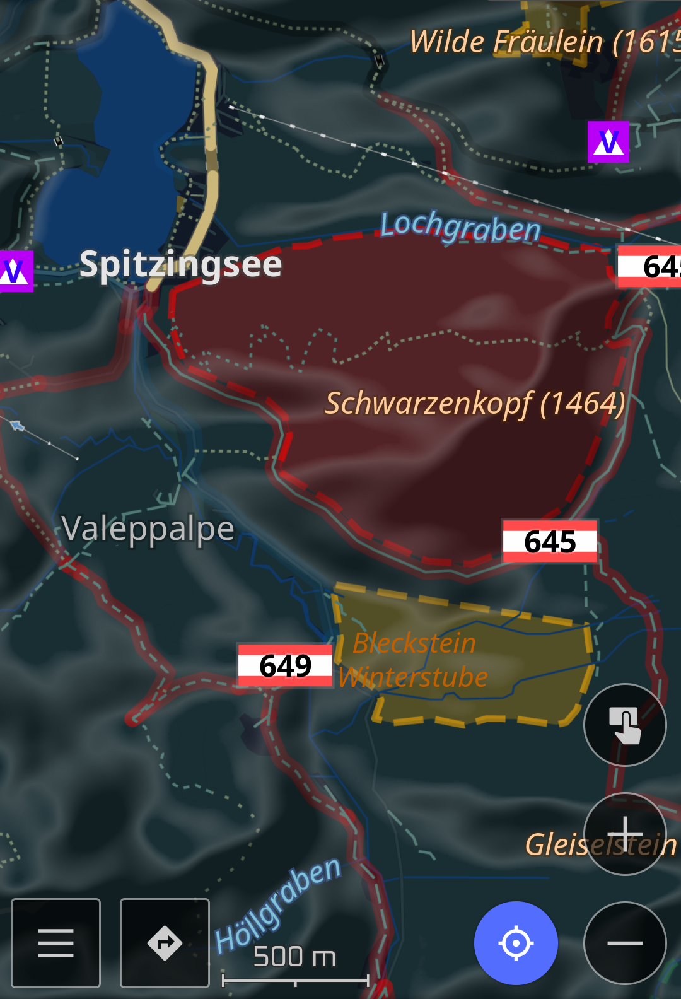
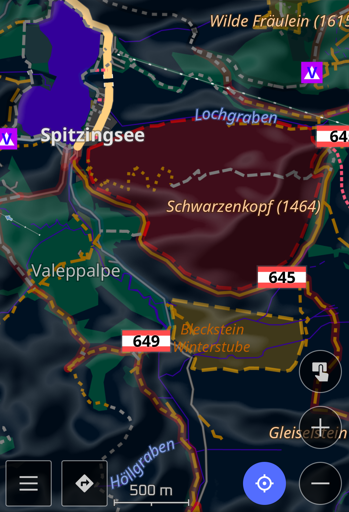
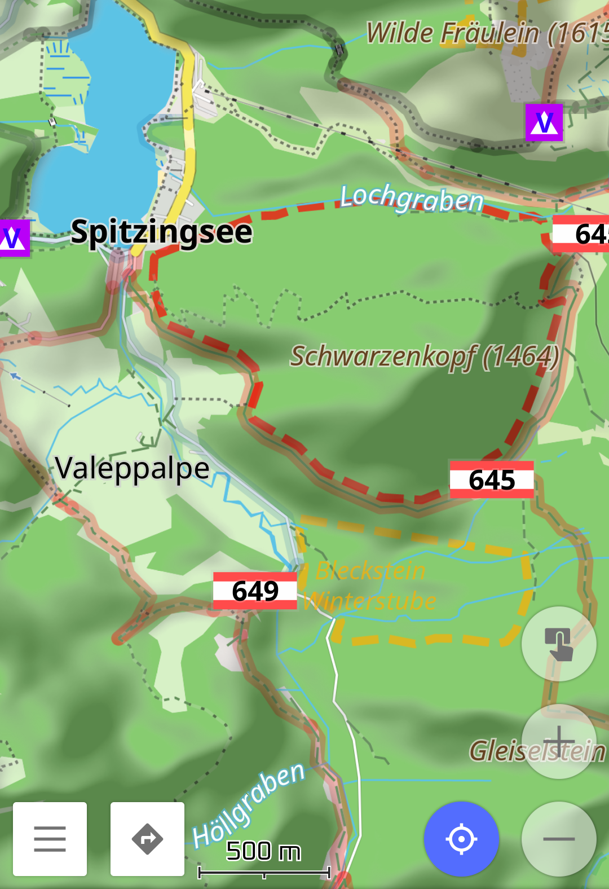
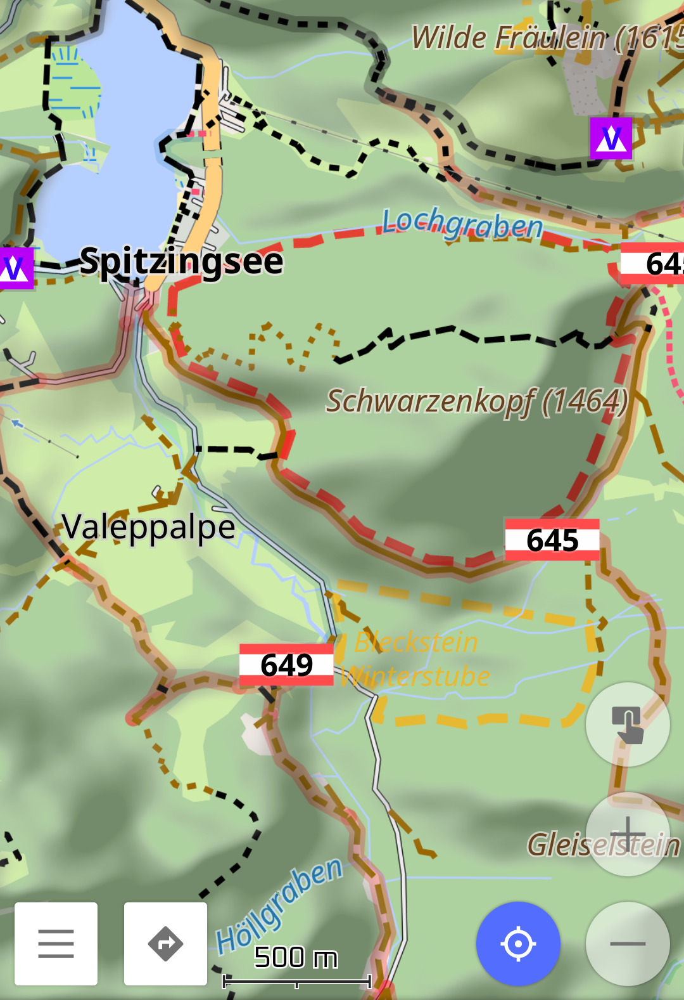
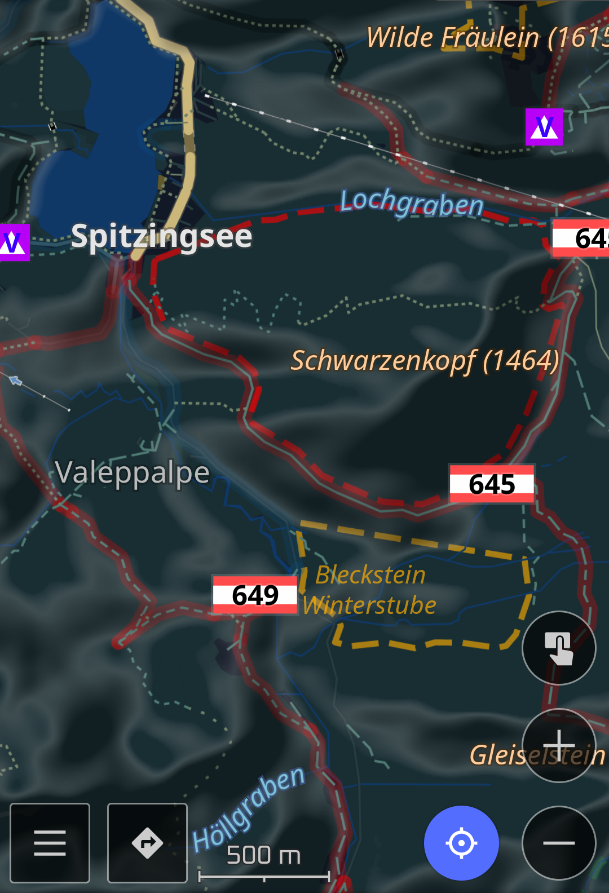
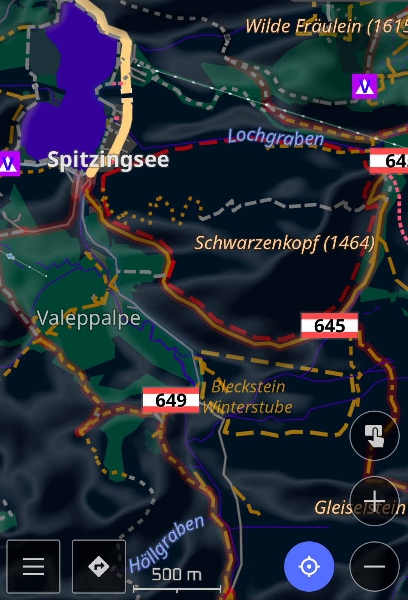

Renders objects complying to boundary=protected_area && protect_class=14 as displayed by e.g. .

Shading of the polygons can be switched on or off.

<table>
	<tr>
		<th></th>
		<th></th>
	</tr>
	<tr>
		<td colspan="2">shaded:</td>
	</tr>
	<tr>
		<td></td>
		<td></td>
	</tr>
	<tr>
		<td></td>
		<td></td>
	</tr>
	<tr>
		<td colspan="2">not shaded:</td>
	</tr>
	<tr>
		<td></td>
		<td></td>
	</tr>
	<tr>
		<td></td>
		<td></td>
	</tr>
</table>
